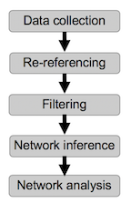

# Sleep-Networks-2021
 
**An Introduction to Network Analysis & EEG Interpretation**

This respository includes an example data set 

[`Example_sleep_data.mat`](Example_sleep_data.mat)

and an example script to analyze these data

[`Example_sleep_data_analysis.m`](Example_sleep_data_analysis.m)

Open the script and run it to implement specific choices for this data analysis pipeline:

The pipeline begins with a multielectrode recording and ends with a functional network. The pipeline is described in more detail in this [presentation](https://github.com/Mark-Kramer/Sleep-Networks-2021/blob/main/Sleep_Networks_Seminar_2021.pdf) at the [Virtual Seminar Series: Computational Approaches to Signal Processing for Sleep](https://prerau.bwh.harvard.edu/seminar/).

The analysis pipeline illustrates one example approach. There are many others.
